## Movie Recommendation System

### 1. Algorithm used for this project

#### 1.1 Common recommendation algorithms

Collaborative Filtering
* User-Based CF
  * A form of collaborative filtering based on the similarity between users calculated using people's ratings of those
    items
    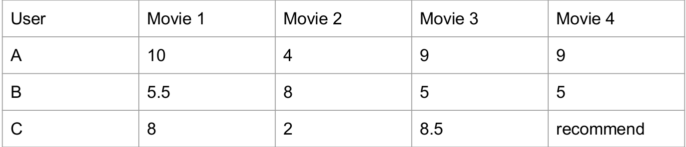
    For different users, initialize their rating matrix for several movies.
    And if we found userA is similar to UserC, we can recommend Movie4 to UserC because similar UserA likes this
    movie as well.
  
* Item-Based CF
  * A form of collaborative filtering based on the similarity between items
    calculated using people's ratings of those items 
    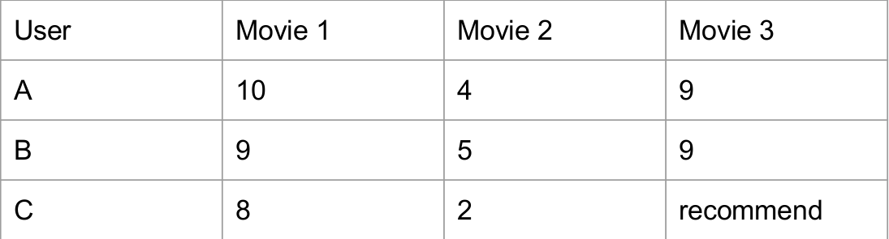
    For different movies, their similarities are calculated by people's ratings. So based on their ratings, the Movie1 
    and Movie3 are more similar with each other than Movie2. So even if UserC who does not watch Movie3, but MovieC 
    is similar to Movie1 which UserC gave a high rating, we can recommend this movie to UserC based on item-based-CF
  
* **The main challenge is how to calculate the similarities between items or users**

#### 1.2 Item-Based Collaborative Filtering

* Why choose Item-Based-CF?
  1. Because the number of users is way too larger than the number of movies. If we try to use user-based-cf, we will
     have to calculate the similarities between users which is quite complex and may not be a good model.
  2. Item (similarities between items) will not change frequently which can simplify the amount of calculation 
  3. It is more convincing to use users' own historical data instead of recommending users with something by someone 
     else.
  
* How to calculate similarity of items?
  * Build co-occurrence matrix
  * Build rating matrix for each user
  * Matrix multiplication to get the recommendation list

* Co-occurrence Matrix
  * When use Item-Based-CF: first to consider how to describe the relationship between different items(movies)
    * Based on user's profile:
      * Watching history: con: some users watch some many movies which are not quite similar.
      * **Rating history**
      * Favorite list
      
    * Based on movie's info
      * Movie category
      * Movie producer
    
  * Rating history:
    * Assume all the users are good user who rate by themselves
    * **If one user rated two movies, both two movies are related**
    * Rating this action somehow shows the interests or full impression of users
    
  * Co-occurrence matrix:
    * Definition: A co-occurrence matrix is a matrix that is defined over an image to be the
      distribution of co-occurring pixel values (grayscale values, or colors) at a
      given offset.
    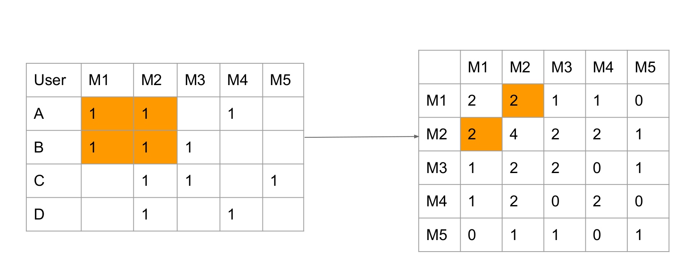
    * The assumption is if a user watched both two movies, the two movies are related. And when this action keeps 
      repeating, the relation (similarity) of this two movies are growing higher and higher. 
      In the image, userA and userB both rated M1 and M2.  
      So value(M1, M2) = value(M2, M1) = Count(x_M1 && x_M2) = 2 (x_M1 means one userX rates M1) 
      
      The left matrix is the rating matrix of different users on different movies. (default score is 1)  
      The right matrix is **co-occurrence Matrix** 
      The diagonal of co-occurrence matrix represents the total watched times of this movies
    
  * Rating Matrix
    * How to tell the difference between movies towards each user?
    
      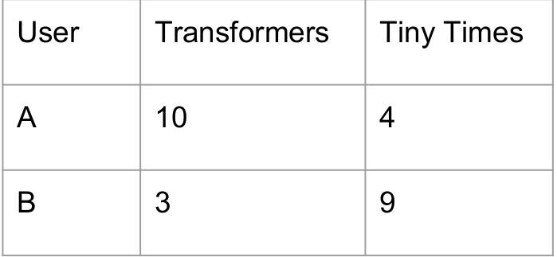
      
      Different users may have different score criterion on the same movie. This could affect the 
      recommendation toward other users. **So it is necessary to find the movie the user likes first**,
      and find the similar movies from the co-occurrence matrix and then do the recommendation.
      
    * Rating matrix: showing the preference of user on the rated movies  
    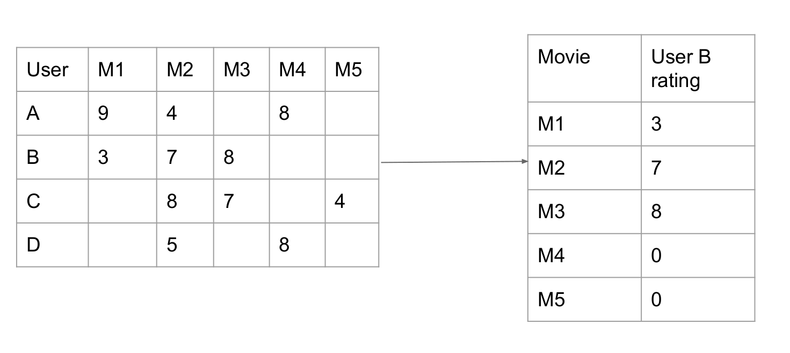
    But it should NOT put M4 and M5 with 0 because UserB has not watched it. Instead, put
    userB's average score based on total scores userB rated / total movies userB watched 
    will make sense 
    
  * Normalization
    * 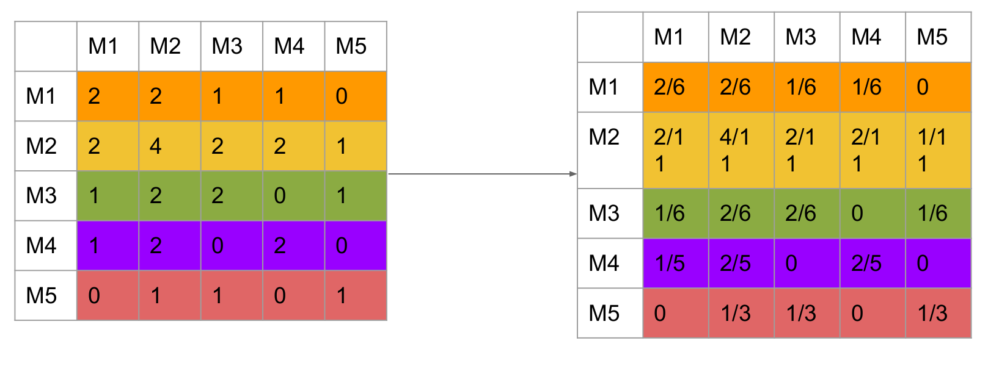
    The original co-occurrence matrix cannot precisely describe the similarity between two movies because the  
    denominator is different. Assume value(M1, M2) is 5 and value(M1, M3) is 3. However what if M2 has relationship 
    with other 1000 movies and M3 only has relationship with other 5 movies. In this way, the M1 and M3 should be more 
    related. This is the reason we apply normalization to make the similarity comparison on the same standard.  
    
    * Each row of normalized matrix represents current movie's similarities with other movies which are both rated by
    one user. In other words, each row means the similarity probabilities between M_x and all other movies.
    * Each entry of the matrix represents the conditional probability. (M1, M2) means given rated M1, what is
    the probability for this user to also rate M2.
    
    * P(A|B) != P(B|A) explains why probability on diagonal are not equal
    
    In this way, the co-occurrence matrix becomes asymmetrical. value(M1, M2) = 2/6, value(M2, M1) = 2/11 
    This can be explained as M1 was not that popular so people who watch both M1 and M2 are even less. So M1 to M2's
    similarity is bigger than M2 to M1's similarity
    
  * Result List by Matrix Multiplication
    * Co-occurrence Matrix x Rating Matrix
    * The principle is if some user has lower rating on M1, then this rating will reduce the weight on the
      movies which have more similarities with M1 and furthermore affect the recommendation result on the 
      movies this user has not yet watched.
      * Example: for For M4 and UserB rating matrix. Multiplication is made by row x column.
                 So the meaning is: for (M4, M1) = 1/5, for unseen M4 of UserB, it has 1/5
                 for UserB to rate 3 score. Likely, 3/5 probability for UserB rate 7 score on
                 M4. M4 and M3 are not similar, so cannot infer the score UserB may rate for M4
                 based on M3.
    * **Unwatched movie's default score cannot be set as 0**. Otherwise this will affect the result list
      (UserB rate high score on M2 however score for M2 in result is lower than original score). The reason 
      is UserB did not watch M4 and M5 and we intuitively set it as 0 so this could make calculation on M2 
      missing some part of weights. And this problem can be avoided if the data is so huge which could fade
      away the effect of some NULL entry in the rating matrix. 
  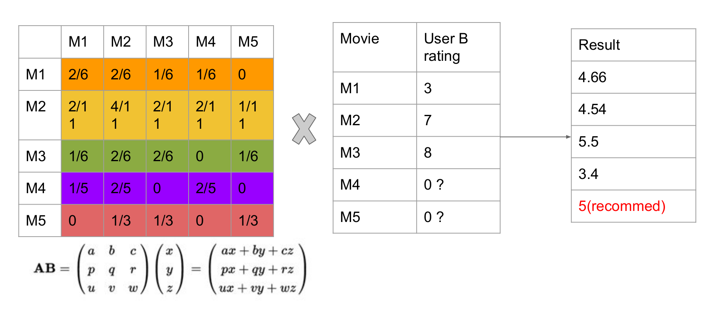

* Raw Data Storage:
  * To guarantee new data can be inserted easily in the future, we store the raw data in sparse matrix format
  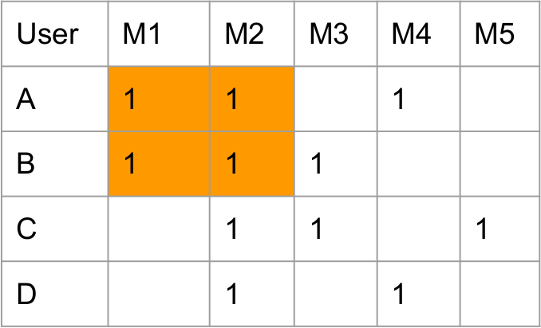
  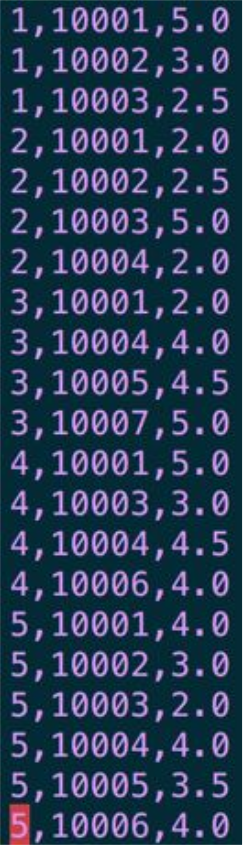
  
  * Each column in the sparse matrix represents:
    * user_id
    * movie_id
    * current user rating for current movie
    
#### 1.3 MapReduce Jobs

* First MapReduce Job: data preprocessing
    * Divide data by user_id
    * Merge data with same user_id
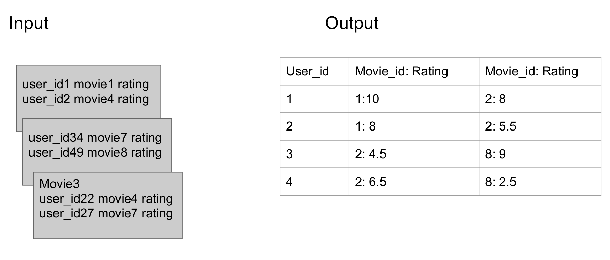

    * Mapper: divide data by user_id
    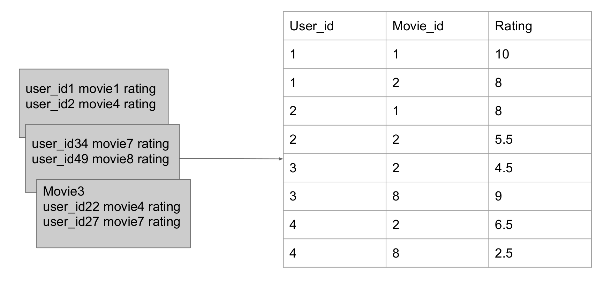
    
    * Reducer: merge data with same user_id
    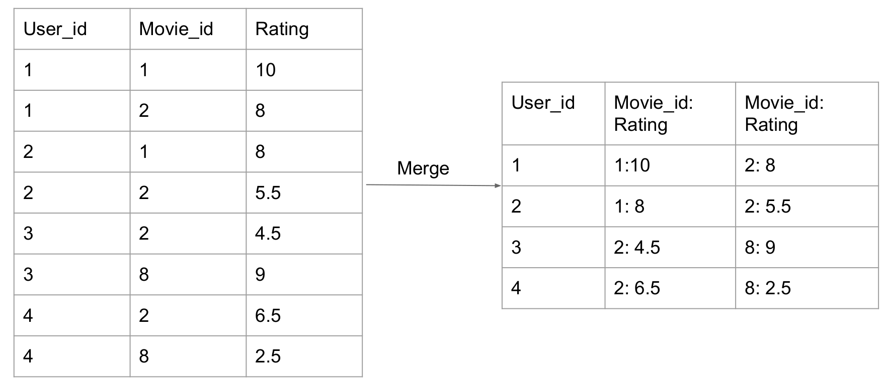

* Second MapReduce Job: build co-occurrence matrix
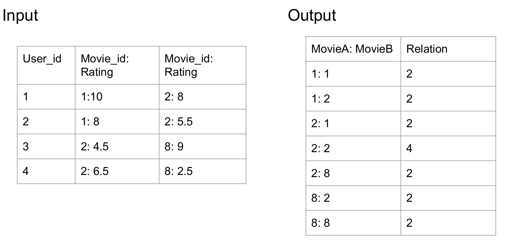
  * Mapper: Count the watch times for **each two movies** (think about word count idea for each movie)
            For for loop on the whole row and count each two movies relation by 1
      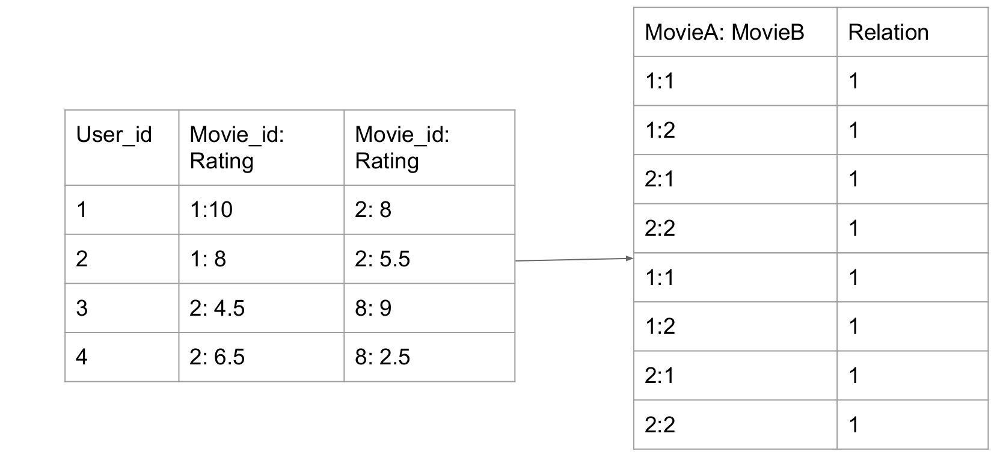
  * Reducer: Merge the result
    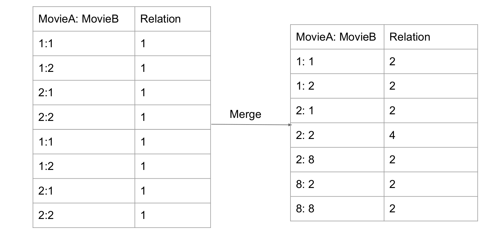

* Jobs ahead:
    * Normalize the Co-occurrence Matrix
    * Get the Rating Matrix
    * Multiply co-occurrence matrix and rating matrix
    * Generate recommendation list
    
* Challenges:
    * Mapper can once read input from one file. So when Mapper reads one row from Co-occurrence Matrix,
    there is nothing from another matrix. So the multiplication cannot happen in this way. 
    One feasible method is to restore Co-occurrence Matrix into a real matrix and cache it in the memory. 
    When Mapper reads one row from Rating Matrix, get data of Co-occurrence Matrix from the memory. 
    Do the multiplication and output to the Reducer.
      * Read the Co-occurrence Matrix and restore in the memory (store in HashMap in setup())
      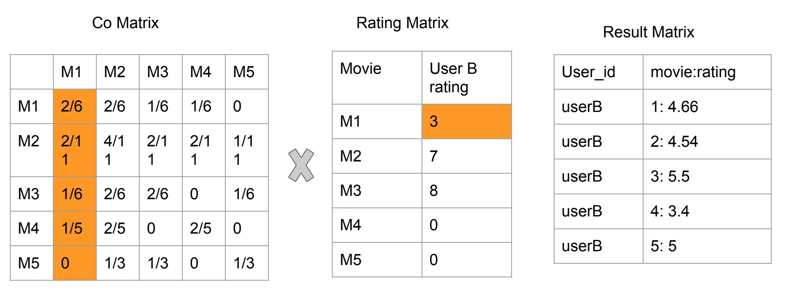
      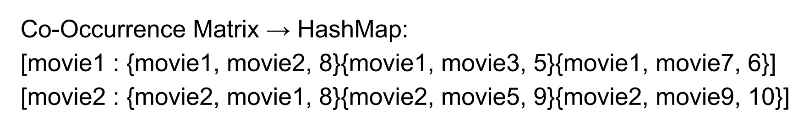
      * Read the Rating Matrix
      * Do the multiplication
      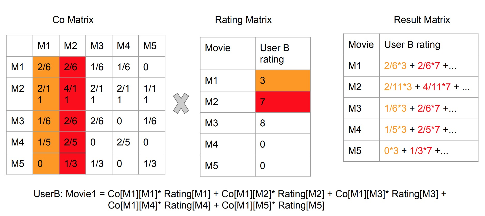
          * Why store a column in HashMap instead of a row is:
              1. Co-occurrence Matrix rows and columns are symmetrical before normalization
              2. Mapper job is to calculate corresponding entry multiplication.
                 So when reads userB rating on M1 (3), it should be multiplied with 2/6, 2/11...,
                 when reads userB rating on M2 (7), it should be multiplied with 2/6, 4/11...
                 And let the reducer do the sum job like we do in real matrix multiplication process (row x column)
                 
      One potential problem is when the matrix is too huge, it would cause OutOfMemoryError
    
* Normalize the Co-occurrence Matrix
    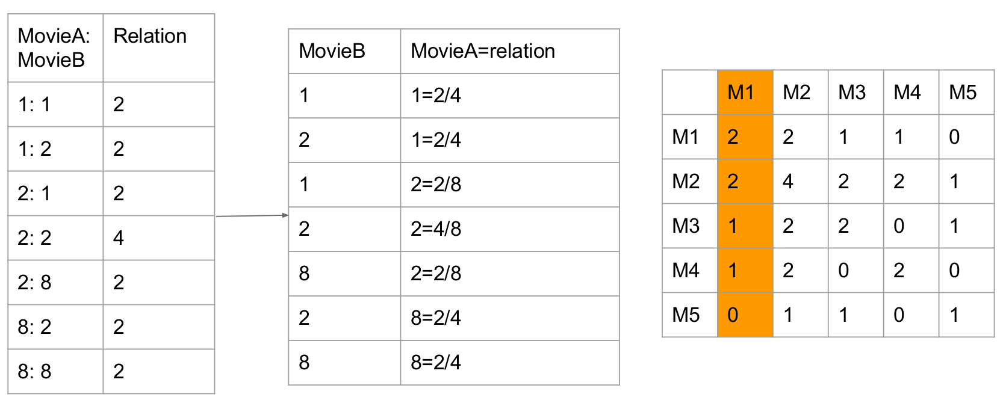